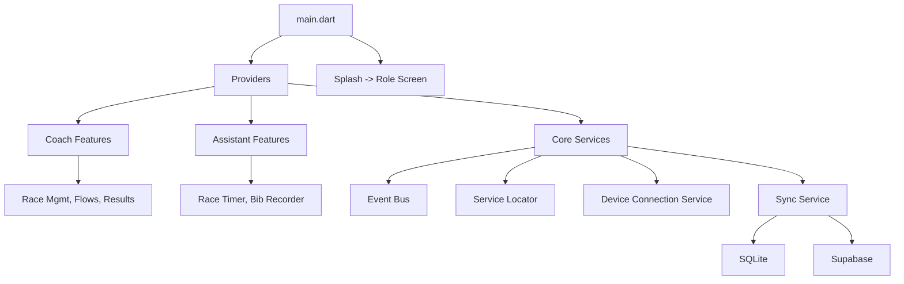

# 02 — Architecture Overview

Last reviewed: 2025-08-11

## Layout and modules

- `lib/core/**`: services, components, theme
- `lib/assistant/**`: Race Timer, Bib Recorder
- `lib/coach/**`: flows, race management, results
- `lib/shared/**`: models, shared screens
- `lib/features/**`: re-exports for simpler imports

## State and DI

- Providers for controllers
- EventBus for pub/sub: `lib/core/services/event_bus.dart`
- Service Locator for DI: `lib/core/services/service_locator.dart`

## Data

- Local: SQLite in `lib/core/utils/database_helper.dart` (normalized schema)
- Remote: Supabase/Postgres (`db/remote_schema.sql`)
- Sync: offline-first in `lib/core/services/sync_service.dart`

## Connectivity

- Nearby Connections wrapper: `lib/core/services/device_connection_service.dart`
- Protocol: `lib/core/utils/data_protocol.dart` (DATA/ACK/FIN, retries, chunking)

## Diagrams

