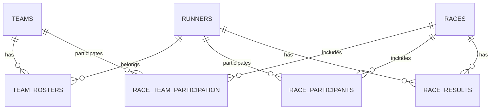

# 03 — Data Overview

Last reviewed: 2025-08-11

The app uses a normalized SQLite schema locally and Postgres remotely (via Supabase), synchronized with an offline-first policy.

## Entities

- Runners, Teams, Team Rosters
- Races, Race Team Participation, Race Participants
- Race Results
- Sync State (cursor store)

See: [local-schema.md](local-schema.md), [remote-schema.md](remote-schema.md).

## ER Diagram (conceptual)

## Sync model

- Local writes set `is_dirty=1` and update `updated_at`.
- Push upserts by `uuid` and clears dirty flags.
- Pull by `updated_at` cursor per table; Last-Write-Wins on `updated_at`.
- Cursors stored in `sync_state` table.

See: [sync-service.md](sync-service.md) for details.
