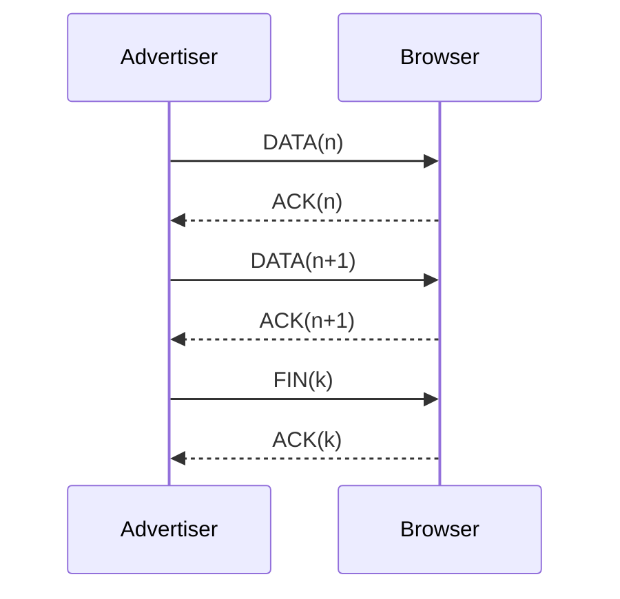

# 04 — Connectivity & Protocol

Last reviewed: 2025-08-11

Sources: `lib/core/services/device_connection_service.dart`, `lib/core/utils/data_protocol.dart`

## Roles and modes

- Roles: Coach, Bib Recorder, Race Timer
- Modes: Advertiser (sender) vs Browser (receiver)

## Nearby Connections

- Strategy: `P2P_STAR`
- Behavior: init, browse/advertise, accept connections, send messages

## Protocol (DATA/ACK/FIN)

- Chunking: `chunkSize = 1000` characters per DATA
- Reliability: `maxSendAttempts = 4`, `retryTimeoutSeconds = 5`
- Types: `DATA(n)`, `ACK(n)`, `FIN(k)`
- Flow: `DATA(n)` → `ACK(n)` … `FIN(k)` → `ACK(k)`; receiver assembles payload
- Checksums: `Package.checksumsMatch()` validates DATA

### Sequence diagram

## Retries, timeouts, and backpressure

- Sender retries each package up to 4 attempts with 5s spacing
- Aborts if device disconnects during transmission
- `handleDataTransfer` supports an external `shouldContinueTransfer()` to abort after persistent bad state (>3s)

## Versioning and compatibility

- Keep `chunkSize`, retry counts, and message types stable across releases
- If protocol changes, bump a protocol version in the payload and gate behavior

## Permissions

- Ensure Bluetooth and Location permissions granted on both devices

## Troubleshooting

- Restart discovery/advertising, or restart the app to reset state
- Check logs from `Logger` for ACK/FIN sequences and retry counts
